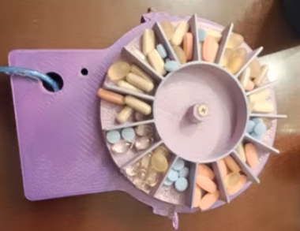

<!--
Hey, thanks for using the awesome-readme-template template.  
If you have any enhancements, then fork this project and create a pull request 
or just open an issue with the label "enhancement".

Don't forget to give this project a star for additional support ;)
Maybe you can mention me or this repo in the acknowledgements too
-->
<div align="center">



# Automatic Medication Dispenser In Order To Reduce Medication Non-Adherence  

This project is an AI-powered automatic medication dispenser designed to improve medication adherence using a combination of image recognition, OCR, and natural language processing. The system is built for patients, caregivers, and healthcare providers to ensure safe and timely medication intake — all while being monitored remotely through a mobile app.

It integrates hardware control (Arduino), YOLO-based pill recognition, and a custom-trained spaCy NLP model to extract dosage and frequency instructions from prescription labels. A PyQt6 desktop interface manages the system on-device, and a mobile app enables remote supervision. 

All the resources I used for this project can be found in the following Google Drive, linked for your reference: https://drive.google.com/drive/folders/1BSqckdxfqDh0ZibXCd9fYPzXVN9h-TSW 

[](https://github.com/SophieBarriault/Dispenser/graphs/contributors)
[](https://github.com/SophieBarriault/BioPredict-Regression-Models-for-Synthetic-Biology)
[](https://github.com/SophieBarriault/BioPredict-Regression-Models-for-Synthetic-Biology/network/members)
[](https://github.com/SophieBarriault/BioPredict-Regression-Models-for-Synthetic-Biology/stargazers)
[](https://github.com/SophieBarriault/BioPredict-Regression-Models-for-Synthetic-Biology/issues)
[](https://github.com/SophieBarriault/BioPredict-Regression-Models-for-Synthetic-Biology/blob/main/LICENSE)

[View Demo](https://github.com/sophiebarriault/BioPredict) ·
[Documentation](https://github.com/sophiebarriault/BioPredict) ·
[Report Bug](https://github.com/sophiebarriault/BioPredict/issues) ·
[Request Feature](https://github.com/sophiebarriault/BioPredict/issues)

</div>

---

# 📔 Table of Contents

- [About the Project](#-about-the-project)
  - [Screenshots](#-screenshots)
  - [Tech Stack](#-tech-stack)
  - [Features](#-features)
  - [Color Reference](#-color-reference)
  - [Environment Variables](#-environment-variables)
- [Getting Started](#-getting-started)
  - [Prerequisites](#-prerequisites) 
  - [Run Locally](#-run-locally)
  - [Deployment](#-deployment) 
- [FAQ](#-faq)
- [License](#-license)
- [Contact](#-contact)
- [Acknowledgements](#-acknowledgements-) 


---

## 🌟 About the Project

This project presents an AI-powered automatic medication dispenser designed to improve medication adherence and safety for patients. Initially developed for the Massachusetts Science & Engineering Fair (MSEF), the device advanced to the State Level Finalist round, where it was recognized for its innovative integration of machine learning, computer vision, and IoT technologies in a healthcare setting.

**Core Features:**

 - Image recognition model to verify whether medication has been taken correctly.

 - OCR + NLP (Named Entity Recognition) to extract dosage instructions from prescription labels.

 - Arduino-controlled dispensing system triggered by AI verification and scheduled reminders.

 - Mobile + Desktop interface (via Toga framework) for caregiver monitoring and remote updates.

 - Video evidence recording for accountability and patient monitoring. 


**Goal:**
To create an accessible, intelligent system that ensures patients take the correct medications at the correct times — reducing errors, improving adherence, and offering peace of mind for caregivers and family members.

**Recognition:**  

 - Filed for a provisional patent for the design and idea December 2024 

 - Selected for the Massachusetts Science & Engineering Fair (MSEF) Regional Round

 - Advanced to the MSEF State Level Competition as a Finalist

 - Praised for its real-world impact, interdisciplinary approach, and scalable potential


---

### 📷 Screenshots


---

### 👾 Tech Stack

- **Python** – Core programming language  
- **scikit-learn** – Regression modeling  
- **pandas** – Data handling  
- **NumPy** – Numerical operations  
- **matplotlib** / **seaborn** – Data visualization 
- **Git & GitHub** – Version control and collaboration 

---

### 🎯 Features

- Predict binary outcomes with logistic regression
- Predict continuous outcomes with linear regression
- Flexible retraining for your own synthetic biology dataset

---

### 🎨 Color Reference

| Color             | Hex        |
| ----------------- | ---------- |
| Primary Color     | `#0074d9`  |
| Secondary Color   | `#00e0ff`  |
| Accent Color      | `#ffffff`  |
| Text Color        | `#00e0ff`  |

---

### 🔑 Environment Variables

To run this project, add the following to your `.env` file:


<!-- Getting Started -->
## 	:toolbox: Getting Started

<!-- Prerequisites -->
### :bangbang: Prerequisites

This project uses NumPy, Pandas, Matplotlib, and Sklearn 

```bash
 pip install numpy 
 pip install pandas
 pip install matplotlib
 pip install scikit-learn 
```
<!-- Run Locally -->
### :running: Run Locally

Clone the project

```bash
  git clone https://github.com/SophieBarriault/BioPredict-Regression-Models-for-Synthetic-Biology.git
```

Go to the project directory

```bash
  cd BioPredict-Regression-Models-for-Synthetic-Biology 
```

Install dependencies

```bash
  pip install numpy 
  pip install pandas
  pip install matplotlib
  pip install scikit-learn 
```

<!-- Deployment -->
### :triangular_flag_on_post: Deployment

To deploy this project run: 

```bash
  python BioPredict-Regression-Models-for-Synthetic-Biology 
```
 


 
<!-- Contact -->
## :handshake: Contact

Sophie Barriault - [Linkedin](www.linkedin.com/in/sophie-barriault) - sophiebarriaultofficial@gmail.com 

Project Link: [https://github.com/Louis3797/awesome-readme-template](https://github.com/Louis3797/awesome-readme-template)


<!-- Acknowledgments -->
## :gem: Acknowledgements 

Useful resources and libraries that I've used in my project: 


 - [Scikit-learn](https://scikit-learn.org/stable/) 
 - [Pandas](https://pandas.pydata.org/) 
 - [NumPy](https://numpy.org/) 
 - [Matplotlib](https://matplotlib.org/) 
 - [Logisitc Regression ML Models Overview](https://www.geeksforgeeks.org/machine-learning/understanding-logistic-regression/)
 - [Linear Regression ML Models Overview](https://www.geeksforgeeks.org/machine-learning/ml-linear-regression/) 
 - [Shields.io](https://shields.io/)
 - [Awesome README](https://github.com/matiassingers/awesome-readme)
 - [Emoji Cheat Sheet](https://github.com/ikatyang/emoji-cheat-sheet/blob/master/README.md#travel--places)
 - [Readme Template](https://github.com/othneildrew/Best-README-Template) 


